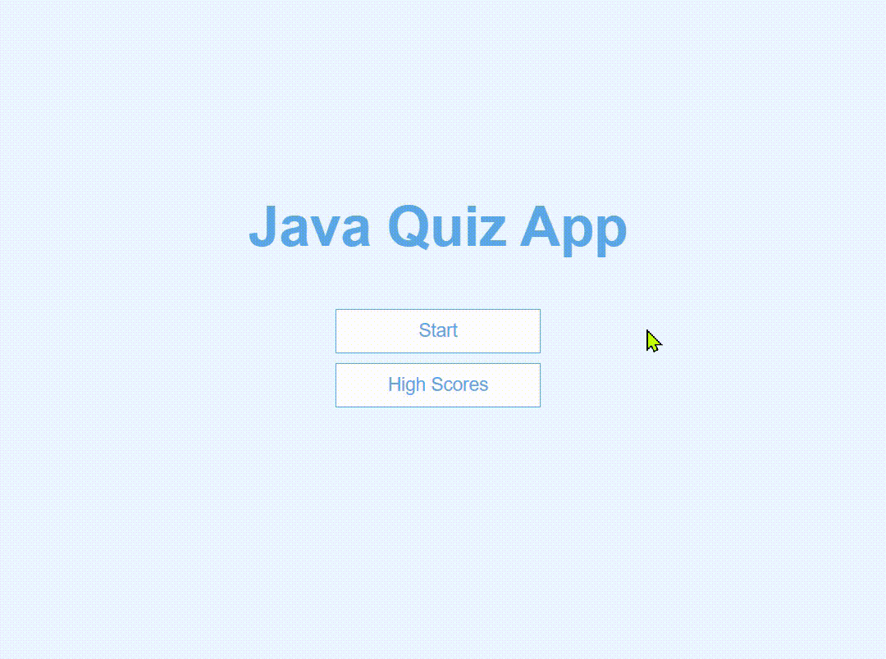

# Java-Knowledge-App
This is a quiz app to test your knowledge on a subject. You can add/remove as many questions as possible within json file or connect to external API to pull questions remotely. 
At the end of the quiz, top 5 scores will be saved and diplayed.

